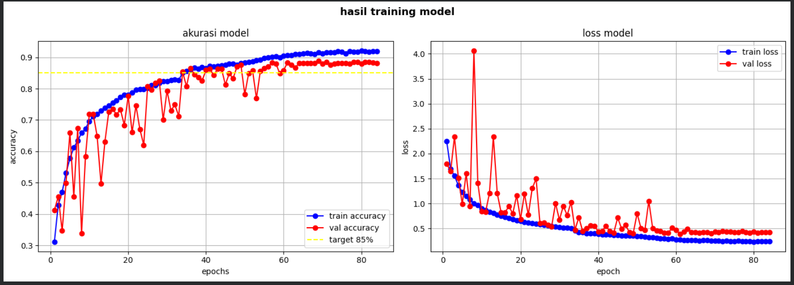
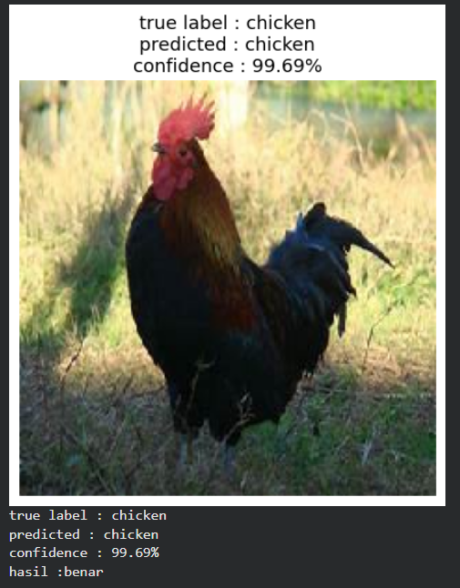

# 🐾 Animals10 Image Classification — CNN Deep Learning

[](https://www.Jupyter.org/)
[](https://www.tensorflow.org/)
[](https://keras.io/)
[](LICENSE)

## 📝 Description

This project implements an image classification system using a **Convolutional Neural Network (CNN)** built from scratch to classify 10 different animal categories.

The model was trained on the [Animals-10 dataset](https://www.kaggle.com/datasets/alessiocorrado99/animals10) from Kaggle, which contains over **26,000 images** with non-uniform resolutions across 10 classes. Training was performed on **Kaggle with GPU P100** for optimal performance.

---

## 📁 File Structure

```
├── proyek-akhir-klasifikasi-gambar.ipynb   # Main training notebook (Kaggle)
├── proyek_akhir_klasifikasi_gambar.py      # Training code in .py format
├── requirements.txt                        # Library dependencies
└── README.md                               # Project documentation
```

> 📦 Model files (SavedModel, TF-Lite, TFJS) are stored on Hugging Face due to GitHub's file size limit:
> **[hanarilearning/Animals10-CNN](https://huggingface.co/hanarilearning/Animals10-CNN)**

---

## 🔄 Workflow

| Step | Description |
|------|-------------|
| 1. **Data Loading** | Load Animals-10 dataset from Kaggle input directory |
| 2. **Visualization** | Display sample images per class with non-uniform resolutions |
| 3. **Preprocessing** | Copy dataset to working directory, rename classes from Italian to English |
| 4. **Data Splitting** | Split dataset into Train (70%), Validation (15%), Test (15%) |
| 5. **Augmentation** | Apply rotation, shift, zoom, flip on training data |
| 6. **Modelling** | Build CNN model with 4 Conv2D blocks + Dense layers |
| 7. **Training** | Train with callbacks: EarlyStopping, ModelCheckpoint, ReduceLROnPlateau |
| 8. **Evaluation** | Evaluate model on test set, plot accuracy & loss |
| 9. **Confusion Matrix** | Visualize per-class prediction performance |
| 10. **Model Conversion** | Export to SavedModel, TF-Lite, and TensorFlow.js |
| 11. **Inference** | Run prediction using SavedModel on a random test image |

---

## 📌 Dataset

| Info | Detail |
|------|--------|
| **Source** | [Kaggle — Animals-10 by alessiocorrado99](https://www.kaggle.com/datasets/alessiocorrado99/animals10) |
| **Original Language** | Italian (renamed to English) |
| **Total Images** | ~26,000+ images |
| **Image Resolution** | Non-uniform (varies per image) |
| **Number of Classes** | 10 |
| **Input Size** | 224 × 224 × 3 (RGB) |

### Class Distribution

| Class | Original Name (Italian) |
|-------|------------------------|
| Butterfly | farfalla |
| Cat | gatto |
| Chicken | gallina |
| Cow | mucca |
| Dog | cane |
| Elephant | elefante |
| Horse | cavallo |
| Sheep | pecora |
| Spider | ragno |
| Squirrel | scoiattolo |

### Dataset Split

| Split | Ratio | Total Images |
|-------|-------|-------------|
| Train | 70% | ~18,200 |
| Validation | 15% | ~3,900 |
| Test | 15% | ~3,935 |

---

## ⚙️ Data Augmentation

Applied only on **training data** to increase variety and prevent overfitting:

| Parameter | Value | Description |
|-----------|-------|-------------|
| `rescale` | 1/255 | Normalize pixel values to 0–1 |
| `rotation_range` | 30° | Random rotation up to 30 degrees |
| `width_shift_range` | 0.2 | Horizontal shift up to 20% |
| `height_shift_range` | 0.2 | Vertical shift up to 20% |
| `shear_range` | 0.2 | Shear transformation up to 20% |
| `zoom_range` | 0.2 | Random zoom up to 20% |
| `horizontal_flip` | True | Random horizontal flip |
| `fill_mode` | nearest | Fill empty pixels with nearest value |

> Validation and Test data only use `rescale` (no augmentation) to ensure unbiased evaluation.

---

## 🤖 Model Architecture

Built using **Keras Sequential API** with 4 Convolutional blocks followed by Dense layers:

| Layer | Type | Filters/Units | Activation |
|-------|------|--------------|------------|
| Input | Input | (224, 224, 3) | — |
| Block 1 | Conv2D + BN + MaxPool + Dropout | 64 | ReLU |
| Block 2 | Conv2D + BN + MaxPool + Dropout | 128 | ReLU |
| Block 3 | Conv2D + BN + MaxPool + Dropout | 256 | ReLU |
| Block 4 | Conv2D + BN + MaxPool + Dropout | 512 | ReLU |
| Flatten | Flatten | — | — |
| Dense | Dense + BN + Dropout | 512 | ReLU |
| Output | Dense | 10 | Softmax |

**Compilation Settings:**

| Parameter | Value |
|-----------|-------|
| Optimizer | Adam (lr = 0.001) |
| Loss Function | Categorical Crossentropy |
| Metrics | Accuracy |

---

## 📋 Callbacks

| Callback | Configuration | Purpose |
|----------|--------------|---------|
| `ModelCheckpoint` | monitor: `val_accuracy`, save best only | Save best model during training |
| `EarlyStopping` | monitor: `val_accuracy`, patience: 15 | Stop training if no improvement |
| `ReduceLROnPlateau` | monitor: `val_loss`, factor: 0.5, patience: 5 | Reduce learning rate on plateau |
| `MyCallback` | accuracy ≥ 0.95 & val_accuracy ≥ 0.95 | Stop training when target is reached |

---

## 📊 Training Results

| Metric | Value |
|--------|-------|
| **Training Accuracy** | 92.10% |
| **Validation Accuracy** | 88.07% |
| **Test Accuracy** | 89.00% |
| **Total Epochs Run** | 84 (best at epoch 69) |
| **Early Stopping** | ✅ Activated |

> ✅ All accuracy values exceed the minimum requirement of **85%**

### Accuracy & Loss Plot



---

## 📉 Classification Report (Test Set)

| Class | Precision | Recall | F1-Score | Support |
|-------|-----------|--------|----------|---------|
| Butterfly | 0.92 | 0.92 | 0.92 | 318 |
| Cat | 0.88 | 0.92 | 0.90 | 251 |
| Chicken | 0.93 | 0.92 | 0.93 | 466 |
| Cow | 0.81 | 0.76 | 0.78 | 281 |
| Dog | 0.92 | 0.84 | 0.88 | 730 |
| Elephant | 0.75 | 0.96 | 0.84 | 218 |
| Horse | 0.87 | 0.88 | 0.87 | 394 |
| Sheep | 0.77 | 0.87 | 0.82 | 273 |
| Spider | 0.96 | 0.95 | 0.95 | 724 |
| Squirrel | 0.93 | 0.88 | 0.91 | 280 |
| **Accuracy** | | | **0.89** | **3935** |
| Macro Avg | 0.87 | 0.89 | 0.88 | 3935 |
| Weighted Avg | 0.89 | 0.89 | 0.89 | 3935 |

---

## 🔍 Inference Result

The model was tested using the **SavedModel** format on a random image from the test set:

| Info | Detail |
|------|--------|
| **Model Used** | SavedModel |
| **True Label** | Chicken |
| **Predicted Label** | Chicken ✅ |
| **Confidence** | 99.69% |

### Inference Screenshot



---

## 💾 Model Conversion

All three model formats were successfully exported:

| Format | Location | Size |
|--------|----------|------|
| **SavedModel** | `saved_model/` | ~404 MB |
| **TF-Lite** | `tflite/model.tflite` | ~202 MB |
| **TensorFlow.js** | `tfjs_model/` | ~201 MB |

### 📦 All model files are available on Hugging Face:
**[hanarilearning/Animals10-CNN](https://huggingface.co/hanarilearning/Animals10-CNN)**

---

## 📦 Libraries Used

| Library | Purpose |
|---------|---------|
| `tensorflow` | Model building, training, and conversion |
| `keras` | High-level neural network API |
| `numpy` | Array and numerical operations |
| `matplotlib` | Visualization (plots, images) |
| `seaborn` | Confusion matrix heatmap |
| `scikit-learn` | Classification report & confusion matrix |
| `tensorflowjs` | Export model to TensorFlow.js format |
| `Pillow` | Image processing |

---

## ⚙️ How to Run

### 1. Clone this repository

```bash
git clone https://github.com/hanaricode/Submission-Image-Classification.git
cd Submission-Image-Classification
```

### 2. Install all dependencies

```bash
pip install -r requirements.txt
```

### 3. Download the dataset

Download the [Animals-10 dataset](https://www.kaggle.com/datasets/alessiocorrado99/animals10) from Kaggle and place it in the appropriate input directory.

### 4. Run the notebook

```bash
jupyter notebook Proyek-Akhir-Klasifikasi-Gambar.ipynb
```

---

## 👤 Author & 📄 License

- **Name** : Hanari
- **Platform** : Kaggle (GPU P100)
- © 2026 Hanari. All Rights Reserved. Licensed under [CC BY-NC-ND 4.0](LICENSE).
